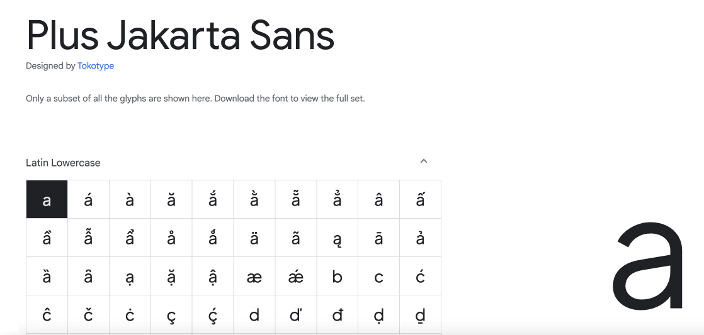
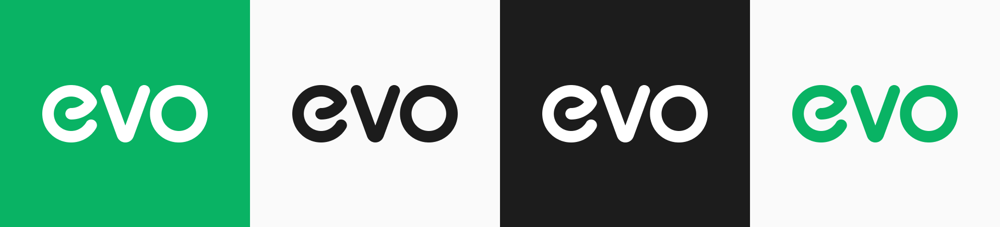
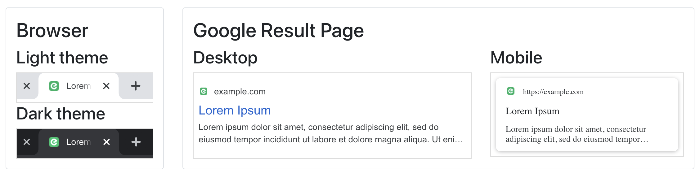

# Assets

## Typeface



Get typeface - [Download zip](https://drive.google.com/file/d/1Q8nQand6Bgng0-zVXcetRlTtSekZiDL6/view?usp=sharing) - [Source](https://fonts.google.com/specimen/Plus+Jakarta+Sans?query=plus+ja)

## Logo



Evo Logo - [Download](https://drive.google.com/file/d/1Vx8KZ-x0p05rdu-j5f11CM06pYWDRtuM/view?usp=sharing)


## Favicons



Get Favicon - [Download package](https://drive.google.com/file/d/1NOPkaKmEjGzNP8CciPUK_vAgoqe82stm/view?usp=sharing)

Extract the package in your project. For example, in `[your project]/public/assets/images`.

Paste the code in your pages:
```
<link rel="icon" type="image/svg+xml" href="/assets/images/favicon.svg">
<link rel="icon" type="image/png" href="/assets/images/favicon.png">
```